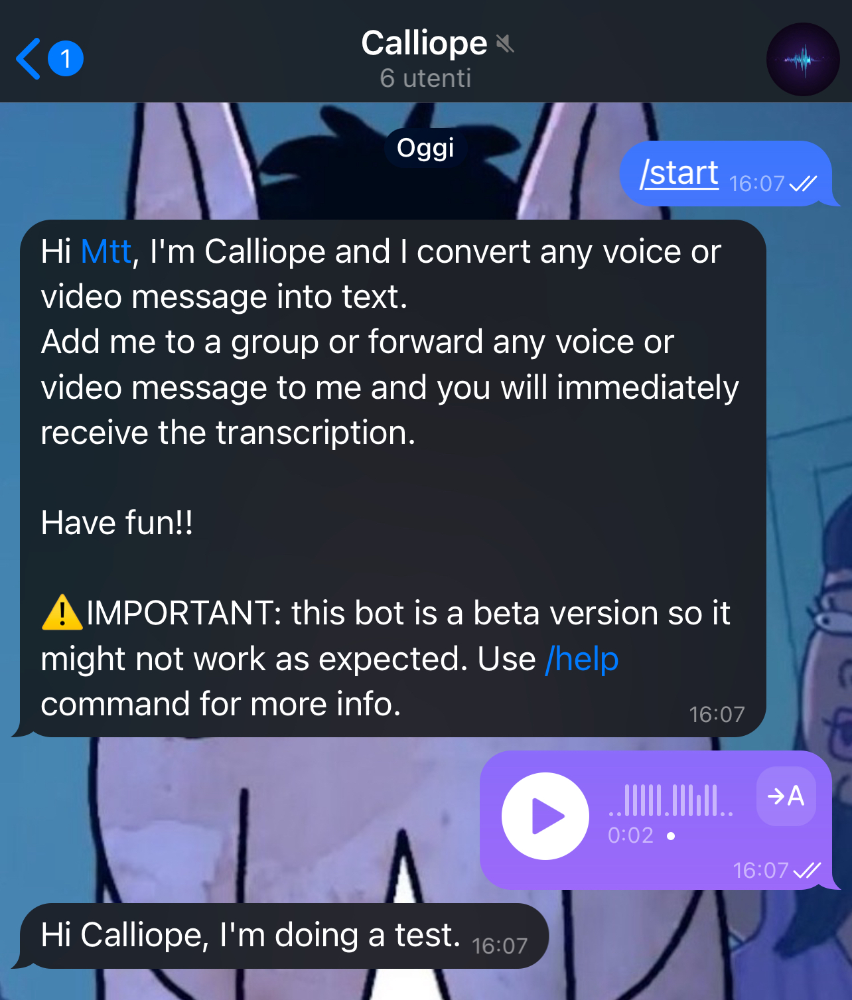

# Calliope
[](https://github.com/MatteoSid/calliope/blob/main/LICENSE)

Calliope is a Telegram bot that transcribes any audio or video message using [faster-whisper](https://github.com/SYSTRAN/faster-whisper) (an optimized reimplementation of OpenAI's Whisper).

### Why should you use Calliope to transcribe messages?
There are many bots that can do this, but it means you have to forward your messages to a third party who can read and listen to everything you send. And if you add a bot to a group as an administrator, it can read everything written in that group. With Calliope you run **your own private bot** on **your own machine**, so you can transcribe all your messages without giving private information to anyone. Transcription text is never logged (only metadata such as duration and processing time), and MongoDB is not exposed outside the Docker network.

<p align="center">
  
</p>

## Features

- **Voice messages & video notes** → transcription streamed live into the chat, split automatically past Telegram's 4096-character limit.
- **Videos** → per-minute timestamped transcript delivered as a `.txt` file.
- **Silence detection** → a muted message gets a 🔇 reaction instead of wasting inference.
- **Per-language transcription** with `/lang`, or automatic language detection.
- **Usage statistics** for users and groups (`/stats`), stored in MongoDB.
- **Owner toolkit** (`/admin`): global stats, error notifications, new-user alerts, and broadcast.
- Runs on **GPU (CUDA) or CPU** — the device is detected automatically.

## Commands

| Command | Description |
|---------|-------------|
| `/start` | Start the bot |
| `/help` | How to use Calliope |
| `/stats` | Show your usage statistics (personal in private chats, group leaderboard in groups) |
| `/lang [code]` | Set the transcription language (e.g. `/lang en`); no argument shows the current one; empty resets to auto-detect |
| `/admin` | Owner-only management toolkit (ignored for everyone else) |

## Requirements

- **Docker** and **Docker Compose** (the recommended way to run Calliope).
- A **Telegram bot token** (see below).
- An **NVIDIA GPU with CUDA** is recommended for fast transcription, but **not required**: with `DEVICE=auto` Calliope automatically falls back to CPU (slower, using `int8` compute). To use the GPU, install the [NVIDIA Container Toolkit](https://docs.nvidia.com/datacenter/cloud-native/container-toolkit/latest/install-guide.html).

Developed and tested on Ubuntu. It may work on other platforms — let me know if you try.

## Get the token from BotFather

Get your token from BotFather following [this guide](https://core.telegram.org/bots/tutorial#obtain-your-bot-token).

Then copy the example environment file:

```bash
cp .env.example .env
```

and set `TELEGRAM_TOKEN` in `.env` to your token. That is the only required value; everything else has sensible defaults (see [Configuration](#configuration)).

## Starting Calliope

```bash
docker compose up -d
```

This starts MongoDB (internal network only) and Calliope. On the first run the Whisper model is downloaded and cached in a Docker volume, so later restarts are fast. Check the logs with:

```bash
docker compose logs -f calliope
```

To stop it:

```bash
docker compose down
```

## Usage

Forward (or send) any voice or video message to your bot, or add the bot to a group to automatically transcribe every voice/video message posted there. Videos are returned as a timestamped `.txt` file.

## Configuration

All configuration lives in the `.env` file (see `.env.example` for a fully commented template). Environment variables always take precedence over the file, so in Docker the compose `env_file:` injection is enough.

| Variable | Default | Description |
|----------|---------|-------------|
| `TELEGRAM_TOKEN` | — (**required**) | Bot token from BotFather. |
| `ADMIN_CHAT_ID` | _(unset)_ | Telegram chat ID of the owner. Enables `/admin`, error notifications and new-user alerts. |
| `MONGO_URI` | `mongodb://localhost:27017` | MongoDB connection URI. In Docker it is `mongodb://mongodb:27017` (already set by the compose file). |
| `MONGO_DB_NAME` | `calliope` | Database name. |
| `MONGO_USERS_COLLECTION` | `users_db` | Collection storing per-user stats. |
| `MONGO_GROUPS_COLLECTION` | `groups_db` | Collection storing per-group stats. |
| `WHISPER_MODEL` | `deepdml/faster-whisper-large-v3-turbo-ct2` | HuggingFace repo of the faster-whisper model. |
| `DEVICE` | `auto` | Inference device: `auto` (CUDA with CPU fallback), `cuda`, or `cpu`. |
| `DEVICE_INDEX` | `0` | GPU index to use when `DEVICE=cuda`. |
| `WHISPER_COMPUTE_TYPE` | _(auto)_ | Compute type override (e.g. `int8_float16`). Default: `float16` on GPU, `int8` on CPU. |
| `DEFAULT_LANGUAGE` | _(auto-detect)_ | Force a transcription language (e.g. `it`, `en`). Empty = auto-detect. |
| `SILENCE_THRESHOLD` | `70` | Energy threshold for the silence pre-filter. |
| `MAX_MEDIA_DURATION_S` | `1800` | Max accepted media duration in seconds. Longer media is politely rejected **before** download. |
| `ALLOWED_CHAT_IDS` | _(empty = public)_ | Comma-separated allowlist of chat IDs (e.g. `123,-456`). Empty = anyone can use the bot. Useful when self-hosting on your own GPU. |
| `LOG_LEVEL` | `INFO` | `DEBUG` \| `INFO` \| `WARNING` \| `ERROR`. |
| `LOG_FILE` | _(stdout only)_ | Optional log file path. When set, it rotates daily with 14-day retention and zip compression. |

### Usage limits

Two knobs let you keep a public deployment under control without touching the code:

- **`MAX_MEDIA_DURATION_S`** — media longer than this is rejected before it is even downloaded, so a two-hour video can't monopolise the GPU.
- **`ALLOWED_CHAT_IDS`** — restrict the bot to a fixed set of users/groups. Leave it empty for a fully public bot.

## Database backup and restore

Back up the MongoDB database to a single compressed file with:

```bash
./scripts/backup_db.sh
```

The backup is saved in the `backups/` folder. To restore it (existing collections are overwritten):

```bash
./scripts/restore_db.sh backups/<backup-file>.archive.gz
```

Both scripts require the MongoDB container to be running (`docker compose up -d mongodb`).

To move Calliope to another machine: run the backup script on the old machine, copy the backup file to the new one, start MongoDB there with `docker compose up -d mongodb`, then run the restore script with the copied file.

## Development

Calliope uses [uv](https://docs.astral.sh/uv/) for dependency management. Install uv, then:

```bash
uv sync                 # create the virtualenv and install all dependencies
cp .env.example .env    # configure your token (see Configuration)
uv run calliope         # run the bot locally (needs a reachable MongoDB)
```

The `makefile` wraps the common tasks:

```bash
make run       # run the bot locally (uv run calliope)
make lint      # ruff check + mypy
make format    # ruff format
make test      # run the test suite
make build     # build the Docker image
make up        # docker compose up
make down      # docker compose down
```

### Code quality

Linting and type-checking use **ruff** and **mypy**, wired through **pre-commit**:

```bash
uv run pre-commit install          # enable the git hooks
uv run pre-commit run --all-files  # run every hook manually
```

### Tests

The suite runs without a GPU, MongoDB, or network access (it uses `mongomock` and fake Telegram objects):

```bash
make test        # or: uv run pytest
```

## License

Released under the [MIT License](LICENSE).
